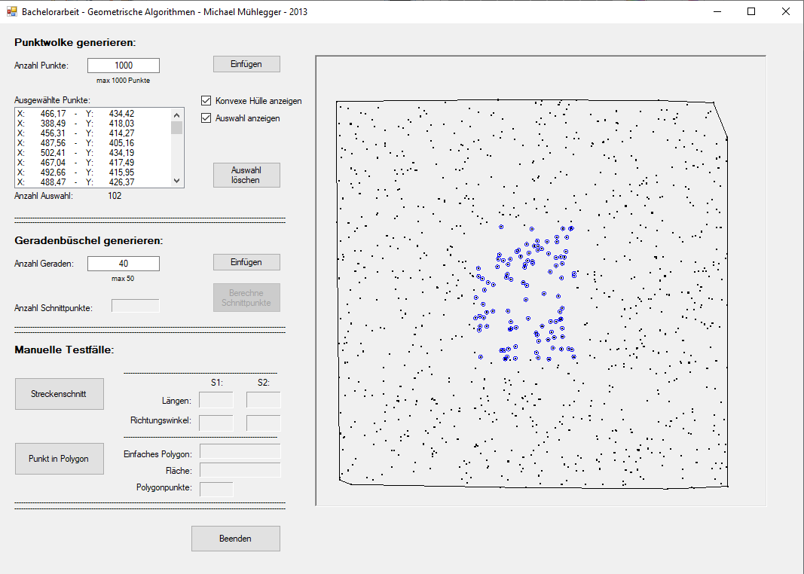

# geometric_algorithms
Geometrische Algorithmen in C#
---------------------------------------------------------------------------------------

Algorithmen für zweidimensionale geometrische Probleme:
<ul>
	<li>Counterclockwise-Algorithmus
	<li>Intersection-Algorithmus
	<li>Sweepline-Algorithmus
	<li>Convex Hull Algorithmus
	<li>Punkt in Polygon Algorithmus
	<li>2D-Suchbaum
<\ul>

 